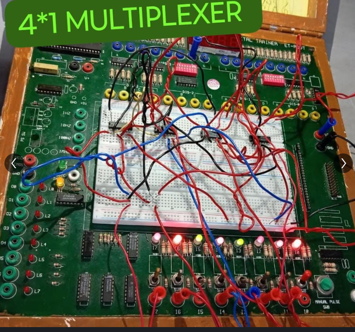

# 🔀 4x1 Multiplexer 
## 📖 Overview
A **4×1 Multiplexer (MUX)** is a combinational logic circuit that selects **one of four input lines** and directs it to a single output line based on **two select lines**.  
Instead of using a ready-made MUX IC (like 74153), I implemented it using **basic logic gate ICs** on a breadboard.

- Number of Inputs: 4 (I0 – I3)  
- Number of Select Lines: 2 (S0, S1)  
- Number of Outputs: 1 (Y)  

---

## ⚡ Logic Expression
The output Y of a 4×1 MUX is:  Y = (~S1 & ~S0 & I0) + (~S1 & S0 & I1) + (S1 & ~S0 & I2) + (S1 & S0 & I3)

Where:  
- `&` = AND  
- `+` = OR  
- `~` = NOT 
## 🧮 Truth Table

| S1 | S0 | Y   |
|----|----|-----|
| 0  | 0  | I0  |
| 0  | 1  | I1  |
| 1  | 0  | I2  |
| 1  | 1  | I3  |

---

## 🛠 Components Used
- **IC 7404** → NOT gates for inverting select lines (S0, S1)  
- **IC 7411** → Triple 3-input AND gates (for each AND term in the expression)  
- **IC 4072** → Dual 4-input OR gates (to combine outputs of AND gates)  
- Breadboard  
- LEDs for output visualization  
- Connecting wires  
- Power supply  

---

## ⚙️ Circuit Implementation
1. **Invert select lines**: Use 7404 NOT gates to generate ~S0 and ~S1.  
2. **AND gates**: Use 7411 ICs to implement the AND terms:  
   - AND1 = ~S1 & ~S0 & I0  
   - AND2 = ~S1 & S0 & I1  
   - AND3 = S1 & ~S0 & I2  
   - AND4 = S1 & S0 & I3  
3. **OR gate**: Use 4072 IC to combine outputs of the AND gates → Y = AND1 + AND2 + AND3 + AND4  
4. Connect LEDs to output to visualize the selected input.  

## 📷 Project Images

## 🎯 Learnings
- Implemented 4×1 MUX **without using a dedicated IC**  
- Learned **combining multiple logic ICs (7404, 7411, 4072)** for hardware implementation  
- Practiced **breadboard wiring and debugging complex combinational circuits**  
- Understood how **NOT, AND, and OR gates** work together in multiplexer design  
