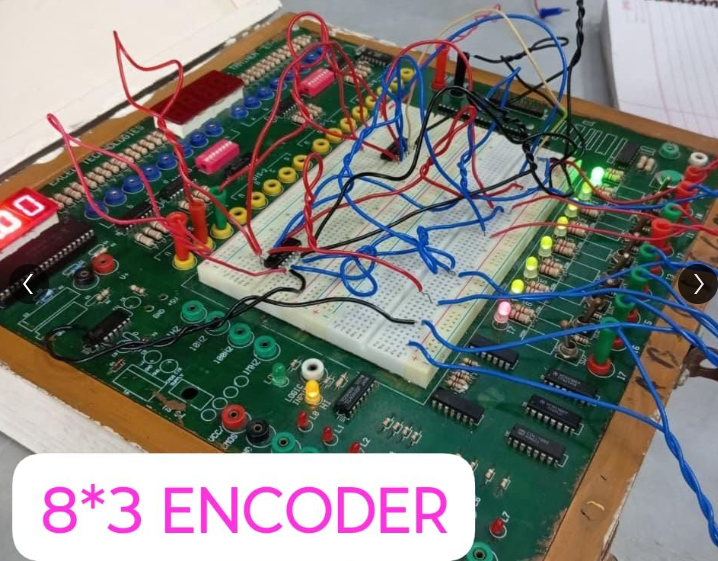

# 🔢 8x3 Encoder (Built Using Logic Gates)

## 📖 Overview
An **Encoder** is a combinational logic circuit that converts **8 input lines** into **3 output lines**.  
Instead of using a dedicated Encoder IC (like 74148), I implemented the circuit using **basic logic gate ICs (4072 OR gates)** on a breadboard.

- Number of Inputs: 8 (I0 – I7)  
- Number of Outputs: 3 (Y2, Y1, Y0)  

---

## ⚡ Logic Expressions
For 8-to-3 Encoder, the outputs are:  

- **Y0 = I1 + I3 + I5 + I7**  
- **Y1 = I2 + I3 + I6 + I7**  
- **Y2 = I4 + I5 + I6 + I7**  

(where `+` = OR operation)

---

## 🧮 Truth Table

| Active Input | Output (Y2 Y1 Y0) |
|--------------|-------------------|
| I0           | 000 |
| I1           | 001 |
| I2           | 010 |
| I3           | 011 |
| I4           | 100 |
| I5           | 101 |
| I6           | 110 |
| I7           | 111 |

---

## 🛠 Components Used
- **IC 4072** (Dual 4-input OR Gates) → used for generating Y0, Y1, Y2  
- **IC 7404** (NOT gates, if required)  
- Breadboard  
- LEDs for output visualization  
- Connecting wires  
- Power supply  

---

## ⚙️ Circuit Implementation
- **2 × 4072 ICs** are required (since each IC has 2 OR gates, and we need 3 OR gates total).  
- Inputs connected to OR gates as per the Boolean expressions.  
- Outputs Y2, Y1, Y0 observed using LEDs.

- 
## 📷 Project Images

---

##  Learnings
- Implemented Encoder logic **without using a dedicated IC**  
- Learned how to design Boolean logic equations with OR gates  
- Practiced breadboard wiring and debugging  
- Understood the use of **4072 IC (Dual 4-inp**
  
